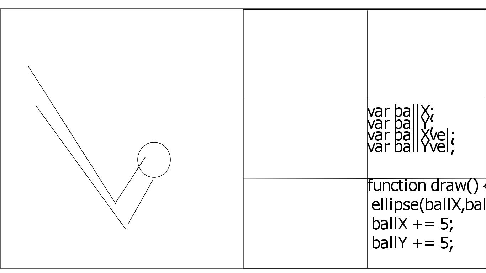

# p5 classroom

An environment for hosting classes of p5 students

Planned features:

- WebRTC-based voice chat
- Simultaneous view of multiple student canvases
- Ability to switch between code and running sketch views of any remote session
- Instructor control of learner views, including
- - Switch to code editor
- - Present a specific learner's code or sketch to all 
- - Present working example sketch or code to all

## Rough sketch:

While the scaled views of learner sketches will require them to be written to scale (use width/height rather than hard-coded values), that will be the only expected hindrance to writing sketches in this environment, as opposed to an editor with a static view.
